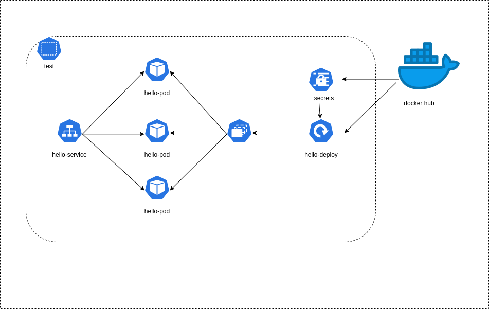

# Exercise 2
Working with minikube and node port

## Diagram:


## We will need

1. Intall docker
2. Kubernetes
3. Install minikube
4. docker hub account

## Instructions:

Login to docker
``` bash
docker login
```

Get configurations 
``` bash
cat ~/.docker/config.json
```

Create a newsecret
``` bash
kubectl create secret generic regcred \
    --from-file=.dockerconfigjson=<path/to/.docker/config.json> \
    --type=kubernetes.io/dockerconfigjson -n test
```

build image inside helloApp
```
docker build -t docker7gm/hello-app:v0.0.3 .
```

(Optional) Run in order if it works
```
docker run -p 8080:8080 docker7gm/hello-app
```

push the image to docker hub
```
docker push docker7gm/hello-app:v0.0.3
```

Create a namespace
```
kubectl apply -f manifests/namespace.yaml
```

Create a deploy
```
kubectl -n test apply -f manifests/deploy.yaml
```

(Optional) See if it is running in the system
```
kubectl port-forward <hello-deployment-pod-name> 9999:8080 -n test
```

Apply service to expose in port
```
kubectl -n test apply -f manifests/np-service.yaml
```

Get services with minikube
```
minikube service hello-service -n test
```

