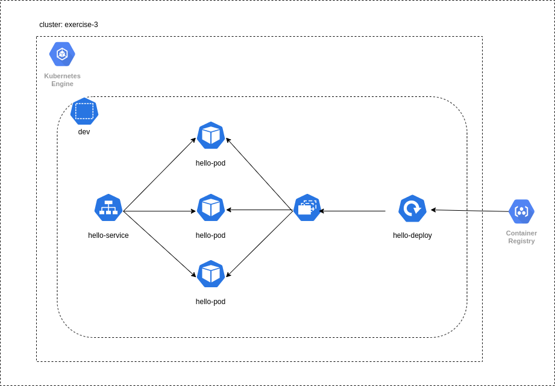

# Exercise 3
## Working with GCP and load balancer service

## Diagram:


## Instructions:

- Create a cluster in kubernetes engine

- Open google cloud shell and set up

	1. export project name
	```
	export PROJECT_ID=<project-id>
	```
	
	2. set configurations
	```
	gcloud config set project <project-id>
	```
	```
	gcloud container clusters \
			get-credentials [cluster-name] \
			--zone [cluster-zone]
	```

	3. clone the repo to the google colud shell


- build and push to container registry
	1. build
	```
	docker build -t gcr.io/${PROJECT_ID}/hello-app:v1 .
	```

	2. authenticate
	```
	gcloud auth configure-docker
	```

	3. push to the container registry
	```
	docker push gcr.io/${PROJECT_ID}/hello-app:v1
	```
	
	4. go to container registry and see the image

- create the namespace
	```
	kubectl apply -f manifests/namespace.yaml
	```

- deploy the app
	1. Edit deployment.yaml with correct project id

	2. run command to create the deployment
	```
	kubectl -n test apply -f manifests/deploy.yaml
	```

  3. test if exist
	```
	kubectl port-forward <hello-deployment-pod-name> 9999:8080 -n test
	```

	4. open other console and test
	```
	curl http://localhost:9999
	```

- create service
	1. run command
	```
	kubectl apply -f service.yaml -n dev
	```

	2. go to service and ingress tab and search the service

	3. go to page in order to see the result
