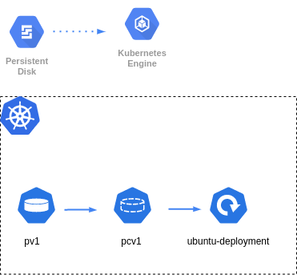

# Exercise 4
## Working with GCP and storage PV, PVC and SC

- On GCP create a cluster and create a disk on cloud engine called sample disk.

### Comands

Get credentials for shell console
``` bash
gcloud container clusters get-credentials
```

Apply changes
``` bash
kubectl apply -f <yaml_file>
```

Get pods
``` bash
kubectl get pods
```

Exec pod and get in the bash console
``` bash
kubectl exec --stdin --tty <pod_name> -- /bin/bash
```

Get PV
``` bash
kubectl get pv
```

Get PVC
``` bash
kubectl get pvc
```

Get SC
``` bash
kubectl get sc
```

### diagrams

- with PV



- with storage Class

